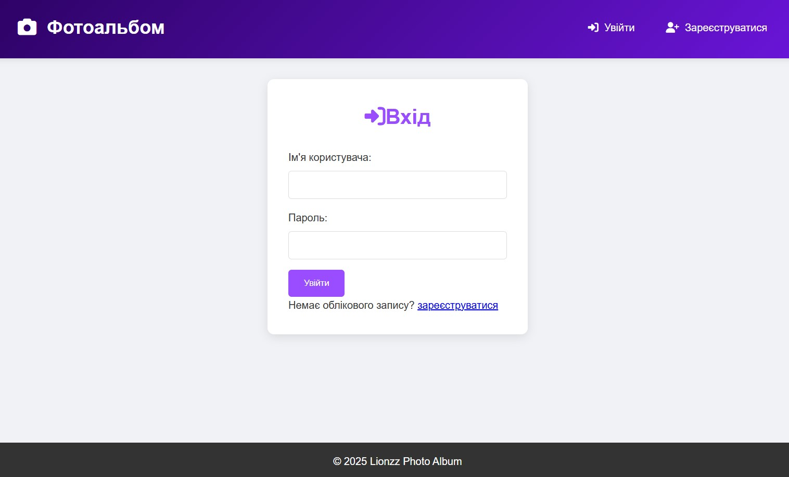
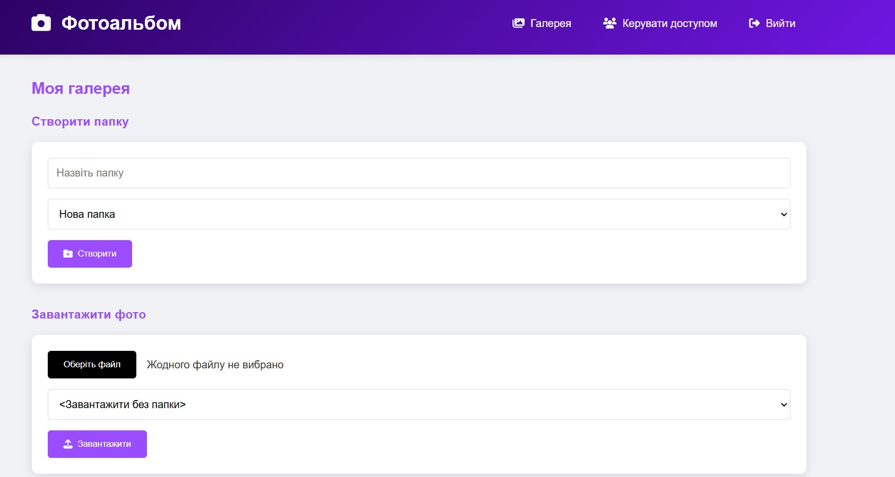

# Flask Photo Gallery

  
  
  
[](https://github.com/LionzzSh/Flask_Photo_Gallery/issues)  
[](https://github.com/LionzzSh/Flask_Photo_Gallery/stargazers)

Ласкаво просимо до **Flask Photo Gallery** — сучасної та інтуїтивно зрозумілої веб-програми, створеної з використанням Flask для керування фотогалереями. Цей проект дозволяє користувачам автентифікуватися, завантажувати фотографії, упорядковувати їх у папки, керувати доступом і ділитися контентом, зберігаючи зображення в хмарному сховищі AWS S3. Додаток активно працює та доступний за посиланням: [https://lionzz.pythonanywhere.com/](https://lionzz.pythonanywhere.com/).

> **Примітка:** Досліджуйте функціонал, тестуйте та діліться відгуками — ваш внесок важливий!

---

## Зміст
- [Функції](#функції)
- [Скріншоти](#скріншоти)
- [Технічний стек](#технічний-стек)
- [Встановлення](#встановлення)
- [Використання](#використання)
- [Розгортання](#розгортання)
- [Як долучитися](#як-долучитися)
- [Ліцензія](#ліцензія)
- [Контакти](#контакти)

---

## Функції
Цей додаток пропонує широкий спектр можливостей для роботи з фотогалереями:

- **Автентифікація користувача**: Реєстрація та вхід із безпечним хешуванням паролів через Flask-Bcrypt.
- **Керування фотографіями**: Завантаження, перегляд, редагування та видалення фото.
- **Організація папок**: Створення та управління папками для зручної категоризації зображень.
- **Інтеграція з AWS S3**: Надійне зберігання фотографій у хмарному сервісі Amazon S3 за допомогою boto3.
- **Спільний доступ**: Генерація посилань для обміну фотографіями чи папками.
- **Керування доступом**: Налаштування прав доступу для користувачів.
- **Адаптивний дизайн**: Прості, але зручні HTML/CSS шаблони для всіх пристроїв.

---

## Скріншоти
Дізнайтесь, як виглядає додаток, переглянувши ці захопливі кадри! Натисніть на зображення, щоб збільшити (за наявності інтерактивних переглядів).

| Сторінка                  | Опис                                      | Скріншот                                      |
|---------------------------|-------------------------------------------|-----------------------------------------------|
| **[Сторінка входу](#)**   | Інтерфейс для автентифікації користувача. |     |
| **[Реєстрація](#)**       | Форма для створення нового акаунта.       |  |
| **[Додавання користувачів](#)** | Панель для керування доступом.         |  |
| **[Перегляд фото](#)**    | Сітка для перегляду завантажених зображень.|       |
| **[Завантаження фото](#)**| Інтерфейс для завантаження в AWS S3.      |  |
| **[Фото завантажено](#)** | Підтвердження успішного завантаження.     |  |
| **[Вибір папки](#)**      | Інтерфейс для вибору або створення папки. |           |
| **[Керування доступом](#)** | Налаштування прав для користувачів.    |  |
| **[Доступ до папки](#)**  | Перегляд спільної папки.                  |  |
| **[Головна сторінка](#)** | Головний екран із галереєю.               |  |

---

## Технічний стек
| Категорія      | Технології/Інструменти                  |
|-----------------|-----------------------------------------|
| **Backend**     | Flask, Flask-SQLAlchemy, Flask-Login, Flask-Bcrypt, boto3 |
| **Зберігання**  | AWS S3                                  |
| **База даних**  | MySQL (або SQLite для локального тестування) |
| **Хостинг**     | PythonAnywhere                          |
| **Контроль версій** | Git, GitHub                       |
| **Версія Python** | 3.10                                    |

---

## Встановлення
1. Клонуйте репозиторій:
   ```bash
   git clone https://github.com/LionzzSh/Flask_Photo_Gallery.git
   cd Flask_Photo_Gallery

2. Створіть віртуальне середовище:
Можна встановлювати без віртуального середовища,проте це робиться щоб не викликати можливих конфліктів у ваших інших проектах
 ```bash
python -m venv venv

source venv/bin/activate  # На Linux/Mac

venv\Scripts\activate     # На Windows
 ```

3. Встановіть залежності:
```bash
pip install -r requirements.txt
 ```

4.Налаштуйте змінні середовища (створіть файл .env):
```bash
FLASK_SECRET_KEY=your-secret-key
AWS_ACCESS_KEY=your-aws-access-key
AWS_SECRET_KEY=your-aws-secret-key
AWS_BUCKET_NAME=your-bucket-name
AWS_REGION=your-region
FLASK_ENV=development
 ```
(Не додавайте .env до Git. Додайте його до .gitignore.)

**Використання:
Запустіть додаток локально:
```bash
python run.py
 ```
Відкрийте браузер і перейдіть за адресою http://localhost:5000.
Зареєструйтеся, увійдіть і почніть завантажувати фотографії або створювати папки.

**Розгортання
Додаток розгорнуто на PythonAnywhere за адресою https://lionzz.pythonanywhere.com/. Щоб розгорнути власну копію:

Завантажте код до Git-репозиторію.
Створіть акаунт на PythonAnywhere і додайте новий веб-додаток із Python 3.10.
Налаштуйте WSGI-файл (/var/www/your_wsgi_file_wsgi.py), щоб він вказував на run.py.
Встановіть змінні середовища в налаштуваннях веб-додатка на PythonAnywhere.
Перезапустіть веб-додаток і протестуйте.

**Ліцензія
Цей проект ліцензовано за ліцензією MIT. Дивіться файл LICENSE для деталей.

**Контакти
Автор: LionzzSh
Email: [Lionzzbritish.com]
GitHub: https://github.com/LionzzSh
Будь ласка, зв’яжіться зі мною для питань, пропозицій або ідей співпраці!
